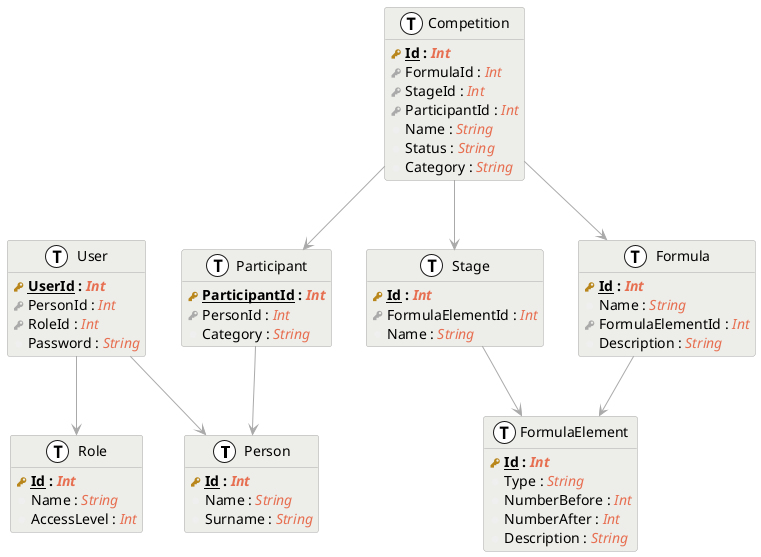

 

  

  <h3 align="center">Astro project</h3>

  

    Astro is an open-source, modern and intuitive competition manager.
  

Astro is using a database to store all the data. So there is a need to think about the database structure and how to use it.

# What we need to store

Different kinds of data will be stored in the database. 

## Persons

A **Person** is a human being. It can be a referee, a participant, an organizer, etc.

We need to store the following data for each person:

- `Id` (unique)
- `Name`
- `Surname`

## Users

The site will be mostly read-only, but there will be some users that will be able to modify the data: organizers, jury members, and admins.

We need to store the following data for each user:

- `UserId` (unique)
- `Person` (see above)
- `Password` (hashed) - generated by an admin?
- `Role` (organizer, admin, referees) - to be able to check if the user has the right to modify the data

## Stages

A **Stage** is a part of the competition. It can be a qualification, a final, a semi-final, etc. It is part of a **Competition**.

We need to store the following data for each stage:

- `Id` (unique)
- `Formula Element` (see below)

## Competitions

A **Competition** is a set of stages, ordered by a **Formula**. 

We need to store the following data for each competition:

- `Id` (unique)
- `Name`
- `Formula` (see below)
- `Stages` (see above)
- `Participants` (see below)
- `Status` (`open`, `closed`, `running`, `finished`)
- `Category` (`FFU20`, ...)
  
## Formulas

A **Formula** is a way to order the stages of a competition. It is a sequence of **Formula elements**.

We need to store the following data for each formula:

- `Id` (unique)
- `Name`
- `Elements` (see below)

## Formula elements

A **Formula element** is a part of a **Formula**. It is an abstraction of a stage. 

We need to store the following data for each formula element:

- `Type` (`qualification`, `final`, `semi-final`, `quarter-final`, `pool`, `direct elimination`, ...)
- `Number of participants`
- `Number of participants that qualify for the next stage`

## Participants

A **Participant** is a **Person** that is participating in a **Competition**.

We need to store the following data for each participant:

- `ParticipantId` (unique)
- `Person` (see above)
- `Category` (`FFU20`, ...)

# Database structure

With all those information, we can create a database structure :

